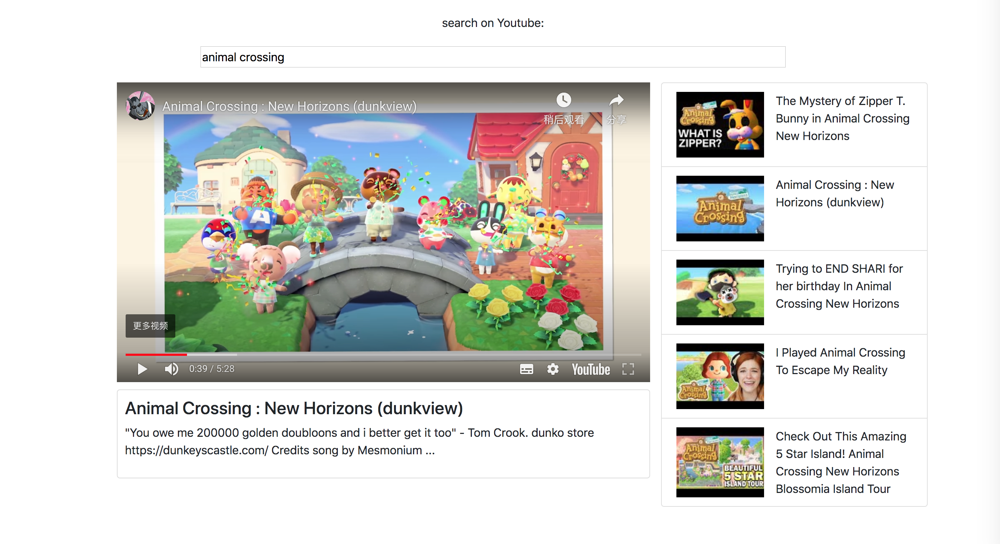
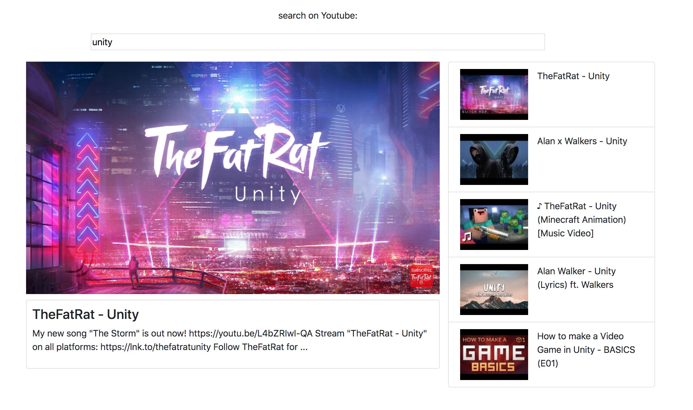
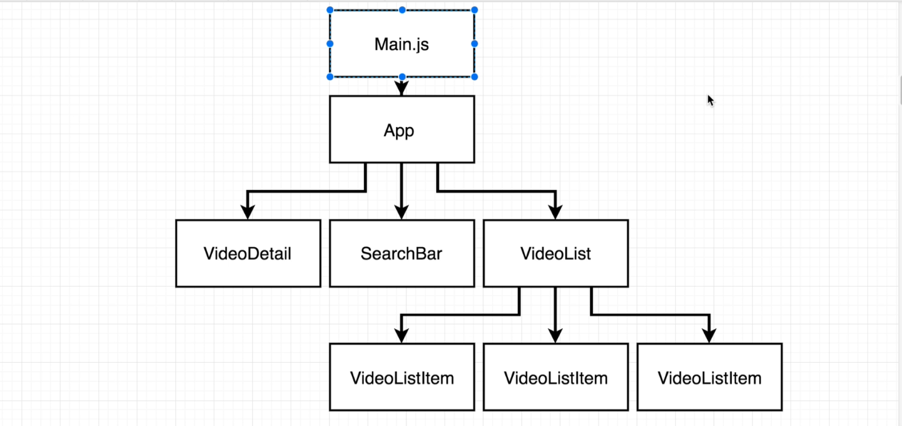

# Vue-js-Essentials-with-Vuex-and-Vue-Router
 Vue-js-Essentials-with-Vuex-and-Vue-Router

App1 Video Browser  

Introduction:  
This app uses **YouTube Data API (v3)** to embed YouTube functionality into the applications.

Online demo:  
http://videobrowser.s3-website-ap-southeast-2.amazonaws.com

1.The screenshots of the video broser

2.The structure of video browser

3.The structure of video browser in code

Youtube API:  
1. document:  
https://developers.google.com/youtube/v3/docs  
2. login:  
https://console.developers.google.com/  

**Note**
YouTube Data API (v3) is free, but it has quota limitation

* Quota NameLimitQueries per day 10,000 
* Queries per 100 seconds per user 300,000 
* Queries per 100 seconds3,000,000 
