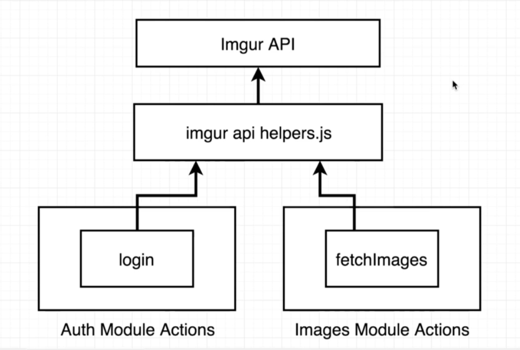

# Vue-js-Essentials-with-Vuex-and-Vue-Router
This folder contains 2 small applications.

**App1 Video Browser**

Introduction:  
This app uses **YouTube Data API (v3)** to embed YouTube functionality into the applications.

App1 Online demo:  
http://videobrowser.s3-website-ap-southeast-2.amazonaws.com

1.The screenshots of the video browser  

2.The structure of video browser

3.The structure of video browser in code

Youtube API:  
1. document:  
https://developers.google.com/youtube/v3/docs  
2. login:  
https://console.developers.google.com/  

**Note**
YouTube Data API (v3) is free, but it has quota limitation

* Quota NameLimitQueries per day 10,000 
* Queries per 100 seconds per user 300,000 
* Queries per 100 seconds3,000,000 

 **How to set up the project**  
 Follow the ReadMe.md file inside the App1_video_browser folder

    

**App2 images synchronization**  

  
Introduction:  
This app invoke **imgur api** to upload images, the images that upload to your application will also synchronize to your own imgur account. 

**Imgur** is an American online image sharing community and image host founded by Alan Schaaf in 2009. 
  

App2 Online demo:  

**Result**  
1.The screenshots of the my imgur account

2.The screenshots of the my images app

2.The structure of images app 

**Signup imgur api**  
https://imgur.com/

**imgur api document**  
https://apidocs.imgur.com/?version=latest

**How to set up the project**  
 Follow the ReadMe.md file inside the App2_images_synchronization folder